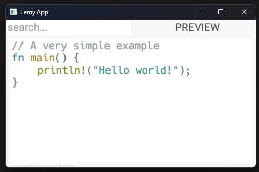

<div align="center">

# LERNY-APP 📖👨🏼‍💻👩🏿‍💻



</div>

## Description
Lerny-App will be an App to teach noobs programming
The App should have the following features:

ToDo:
- CodeEditor
- CodeSnippet Testing
- Support for Learning-Pages like in Jupyter Notebooks
- Share Learning-Pages
- Learning Projects
- Gamification

## Development
How to run and test the app:

```powershell
watchexec -r 'cargo run'
```
watchexec can be installed as follows:
```powershell
cargo install watchexec-cli
```
[Click to read more about watchexec](https://crates.io/crates/watchexec-cli)
